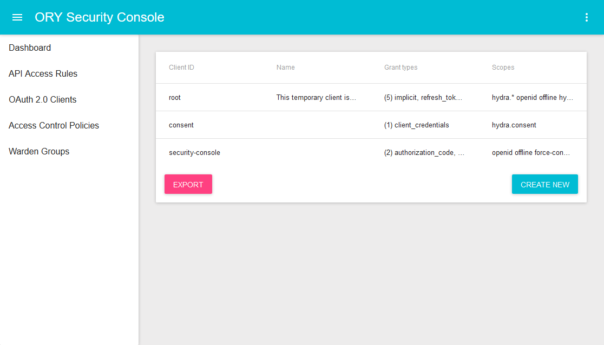

# ORY Oathkeeper

<h4 align="center">
    <a href="https://discord.gg/PAMQWkr">Chat</a> |
    <a href="https://community.ory.am/">Forums</a> |
    <a href="http://eepurl.com/bKT3N9">Newsletter</a><br/><br/>
    <a href="https://www.ory.sh/docs/2-oathkeeper/">Guide</a> |
    <a href="https://www.ory.sh/docs/api/oathkeeper">API Docs</a> |
    <a href="https://patreon.com/user?u=4298803">Support us on patreon!</a>
</h4>

ORY Oathkeeper is an Identity & Access Proxy (IAP) that authorizes HTTP requests based on sets of rules. This proxy integrates with ORY Hydra.

This service is being developed actively.

[](https://circleci.com/gh/ory/oathkeeper)
[](https://coveralls.io/github/ory/oathkeeper?branch=master)


---

<!-- START doctoc generated TOC please keep comment here to allow auto update -->
<!-- DON'T EDIT THIS SECTION, INSTEAD RE-RUN doctoc TO UPDATE -->
- [Installation](#installation)
- [Ecosystem](#ecosystem)
  - [ORY Security Console: Administrative User Interface](#ory-security-console-administrative-user-interface)
  - [ORY Hydra](#ory-hydra)
- [Security](#security)
  - [Disclosing vulnerabilities](#disclosing-vulnerabilities)
- [Telemetry](#telemetry)
- [Documentation](#documentation)
  - [Guide](#guide)
  - [HTTP API documentation](#http-api-documentation)
  - [Upgrading and Changelog](#upgrading-and-changelog)
  - [Command line documentation](#command-line-documentation)
  - [Develop](#develop)

<!-- END doctoc generated TOC please keep comment here to allow auto update -->

## Installation

The easiest way to install ORY Oathkeeper is using the [Docker Hub Image](https://hub.docker.com/r/oryd/oathkeeper/):

```
docker run oryd/oathkeeper:<version> help
```

## Ecosystem

<a href="https://console.ory.am/auth/login">
    
</a>

### ORY Security Console: Administrative User Interface

The [ORY Security Console](https://console.ory.am/auth/login). connects with your existing ORY Hydra and ORY Oathkeeper isntallation and lets you manage and monitor them through an intuitive UI.

### ORY Hydra

ORY Hydra is a hardened OAuth2 and OpenID Connect server optimized for low-latency, high throughput, and low resource consumption. ORY Hydra is not an identity provider (user sign up, user log in, password reset flow), but connects to your existing identity provider through a consent app.

## Security

### Disclosing vulnerabilities

If you think you found a security vulnerability, please refrain from posting it publicly on the forums, the chat, or GitHub
and send us an email to [hi@ory.am](mailto:hi@ory.am) instead.

## Telemetry

## Documentation

### Guide

The Guide is available [here](https://www.ory.sh/docs/2-oathkeeper/).

### HTTP API documentation

The HTTP API is documented [here](https://www.ory.sh/docs/api/oathkeeper).

### Upgrading and Changelog

New releases might introduce breaking changes. To help you identify and incorporate those changes, we document these
changes in [UPGRADE.md](./UPGRADE.md) and [CHANGELOG.md](./CHANGELOG.md).

### Command line documentation

Run `oathkeeper -h` or `oathkeeper help`.

### Develop

Developing with ORY Hydra is as easy as:

```
go get -d -u github.com/ory/oathkeeper
cd $GOPATH/src/github.com/ory/oathkeeper
dep ensure
go test ./...
```

Then run it with in-memory database:

```
DATABASE_URL=memory go run main.go serve all
```
