# Deployment

<!-- toc -->

ORY Oathkeeper is developed as a native cloud application. As such, it is completely stateless, does not require
configuration files and does not persist anything to disk. It is possible to restart ORY Oathkeeper without any side-effects
as ORY Oathkeeper supports graceful HTTP shutdown.

ORY Oathkeeper works natively with Load Balancers and auto-scaling groups. It is configured using environment variables
and relies on a PostgreSQL / MySQL database instance. To answer access requests quickly, rules are cached in-memory
and refreshed within a given interval (e.g. 30 seconds).

ORY Oathkeeper has a tiny footprint as it is compiled to native bytecode. The docker image is a mere 5 MB, the memory
footprint similarly low and the CPU usage is, on average, close to zero.

Thus, two possible deployment layouts are possible for ORY Oathkeeper, which are covered in the next two sections.

## Gateway

In the gateway deployment scenario, ORY Oathkeeper is the single point of entry for all API endpoints. Oathkeeper might
sit behind a load balancer, but is generally deployed in front of the API router. Any incoming requests first
pass ORY Oathkeeper, then the API router, and finally reach the API endpoint service.

The advantage of this deployment layout is that there is only one deployment of ORY Oathkeeper that needs to be maintained.
The disadvantage is that it is not possible to talk to API endpoints directly without going through the full
reverse proxy chain.

## Sidecar

In the sidecar deployment scenario, ORY Oathkeeper is deployed alongside each API endpoint service, probably even
within the same logical unit (e.g. Docker Container or VM) as the service itself.

The advantage of this deployment layout is that requests to the API endpoints are possible without passing through
the API router. The disadvantage is that multiple instances of ORY Oathkeeper have to be maintained.
