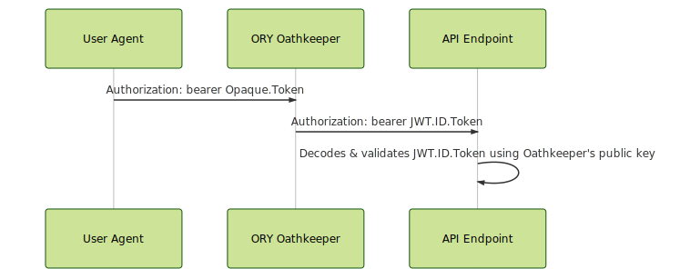

# Security

<!-- toc -->

ORY Oathkeeper, as all ORY products, takes security extremely serious. To reduce risk, ORY Hydra issues opaque access
tokens which are impossible to decode by third parties. Internal services however often rely on stateless authorization
to process requests quickly. The next section covers how ORY Oathkeeper achieves the best of both worlds.

ORY Oathkeeper makes authentication and authorization data consumable to backends by transforming the original
opaque access token to a consumable ID Token (a signed JWT using the RS256 algorithm) as specified
by the OpenID Connect specification and [BeyondCorp](https://www.beyondcorp.com).

## Stateless Authorization

Given an HTTP request to a resource that is protected by ORY Oathkeeper:

```
GET /api/resource HTTP/1.1
Host: www.example.com
Authorization: bearer <opaque-access-token>
```

Assumed that ORY Oathkeeper is granting the access request, the `<opaque-access-token>` will be replaced with a
JSON Web Token that is signed using the asymmetric RS256 key:

```
GET /api/resource HTTP/1.1
Host: internal-api-endpoint-dns
Authorization: bearer <jwt-signed-id-token>
```

Now, the protected resource is capable of decoding and validating the JSON Web Token using the public key supplied
by ORY Oathkeeper's API. The public key for decoding the ID token is available at Oathkeeper's `/.well-known/jwks.json` endpoint:

```
http://oathkeeper:4456/.well-known/jwks.json
```

The endpoint returns an array of valid public keys. Every ID token is equipped with a `kid` (key id) in its header. Use
the `kid` to find the appropriate key. For now, only one public key will be returned and you can simply take the first
element of the array for key validation. We recommend using a library such as [node-jwks-rsa](https://github.com/auth0/node-jwks-rsa)
for handling this appropriately.



## The ID Token

The ID Token contains the following payload keys:

* `iss`: Issuer Identifier for the Issuer of the response. The iss value is a case sensitive URL using the https scheme
    that contains scheme, host, and optionally, port number and path components and no query or fragment components.
    Typically, this is the URL of ORY Oathkeeper, for example: `https://oathkeeper.myapi.com`.
* `sub`: Subject Identifier. A locally unique and never reassigned identifier within the Issuer for the End-User, which
    is intended to be consumed by the Client, e.g., 24400320 or AItOawmwtWwcT0k51BayewNvutrJUqsvl6qs7A4. It must not
    exceed 255 ASCII characters in length. The sub value is a case sensitive string. The End-User might also
    be an OAuth 2.0 Client, given that the access token was granted using the OAuth 2.0 Client Credentials flow.
* `aud`: Audience(s) that this ID Token is intended for. It MUST contain the OAuth 2.0 client_id of the Relying Party
    as an audience value. It MAY also contain identifiers for other audiences. In the general case, the aud value is an
    array of case sensitive strings.
* `exp`: Expiration time on or after which the ID Token MUST NOT be accepted for processing. The processing of this
    parameter requires that the current date/time MUST be before the expiration date/time listed in the value.
    Its value is a JSON number representing the number of seconds from 1970-01-01T0:0:0Z as measured in UTC until the
    date/time. See RFC 3339 [RFC3339] for details regarding date/times in general and UTC in particular.
* `iat`: Time at which the JWT was issued. Its value is a JSON number representing the number of seconds
    from 1970-01-01T0:0:0Z as measured in UTC until the date/time.
* `jti`: A cryptographically strong random identifier to ensure the ID Token's uniqueness.
* `anon`: False if the request was granted to an anonymous user without credentials (`sub` is empty) and true otherwise.

Example:

```
{
  "iss": "https://server.example.com",
  "sub": "24400320",
  "aud": "s6BhdRkqt3",
  "jti": "n-0S6_WzA2Mj",
  "exp": 1311281970,
  "iat": 1311280970,
}
```
